# 🌟 Mental Health AI Chatbot
An AI Chatbot which utilize a series of structured questionnaire data files to build profile-aware conversations and support dual-perspective analysis (Teenager & Parent). This chatbot can understand user profile data and provide accurate, context-
aware answers. It is a functional demo of a Chatbot that:
1. Can conduct basic Q&A conversations with the user.
2. Understands and uses a given User Profile to generate personalized, accurate responses.
3. Maintains response consistency and context awareness during the conversation.

## 🚀 Getting Started

1. **Clone the repository** 

    ```bash 
    git clone https://github.com/wt-rmln/mental-health-ai-chatbot.git
    ```

2. **Install the required dependencies**

    ```bash
    pip install -r requirements.txt
    ```

4. **Set your OpenAI API in a .env file**

3. **Run Streamlit App file**

    ```bash
    streamlit run app.py
    ```

## 📝 Technical design summary

```mermaid
flowchart LR
    A[👤 User] -->|Message| B["💬 Chatbot UI (Streamlit)"]
    B -->|Get profile context| C["🗂 Data Processing (data_processing.py)"]
    C -->|Top gaps, trends, summary| D["🧠 OpenAI API (gpt-4o-mini)"]
    D -->|Stream tokens| B
    B -->|Display answer live| A

    subgraph "Backend Processing"
        C
        D
    end
```



### **Chatbot UI (app.py)**

The chatbot is built on Streamlit, providing a clean, two-pane conversational interface:

* Name input & history retrieval: On first load, the user is prompted to enter the child’s name. The name is normalized (lowercase) for matching and to prevent duplicates from casing differences. If past conversations exist, they are loaded for continuity.
* Conversation history display: The chat window renders both user and assistant messages. st.session_state.messages stores messages for rendering, while st.session_state.history stores the full conversation context for backend use.
* Persistent sessions: All histories are saved in a local db.json file, allowing the chatbot to resume conversations across sessions.
* Responsive input/output: After each user message, the assistant’s response is appended in real time.

⸻

### How the Chatbot Works (OpenAI API + Knowledge Base)

* Base model: The chatbot uses OpenAI’s gpt-4o-mini model for fast, high-quality text generation.
* Dual context injection: Each request includes:
	1.	A system prompt with role instructions (summarization style, empathy, constraints).
	2.	A profile context generated from questionnaire data via build_chat_context() in data_processing.py.
* Knowledge grounding: The injected context includes top gaps, trends, and notable changes between the teen’s and parent’s perspectives, ensuring answers are grounded in actual profile data.
* Adaptive length: The prompt is trimmed to recent messages and the most relevant profile insights to keep token usage low for faster responses.

⸻

### Profile Analysis Logic (Backend)

The backend converts raw questionnaire results into structured, AI-ready insights. The process has five key stages:

1. **Load and Normalize Raw Data**
	* File scan: For the selected child, the backend scans ./data/<child_slug>/*.json for all available monthly questionnaire files (both parent and teen).
	* Parse metadata: Extracts the child name, role (Parent / Teen), and timestamp from each file’s metadata.
	* Answer cleanup:
  		* Maps answer choices (e.g., "A)", "B)") to numeric scores and text labels for analysis.
  		* Handles different formats like "B)", "b.", or "B ) Something" robustly.
	* Dimension tagging: Associates each question with a thematic dimension (e.g., Self-Control, Care, Goal Persistence) based on the raw data.

2. **Pair Parent and Teen Responses**
	* Matching strategy: For each month and dimension, parent and teen responses are matched using:
		1.	Exact Question ID match (after canonicalizing formatting)
		2.	Exact question text match (normalized for casing, punctuation)
		3.	Fuzzy matching (Jaccard similarity) within the same dimension to catch near-duplicates.
	* Output: A unified table of matched Q&A pairs with:
		* Dimension name
		* Question text (parent & teen)
		* Parent numeric & text answer
		* Teen numeric & text answer

3. **Compute Dimension-Level Metrics Over Time**
	* Monthly aggregation: For each child × month × dimension:
		* Calculate parent_avg and teen_avg (mean numeric scores).
		* Compute gap = parent_avg − teen_avg.
	* Time series building: Maintain a chronological record of gaps per dimension.
	* Trend detection:
		* Top gaps: Dimensions with the largest positive or negative gaps in the most recent month.
		* Notable changes: Dimensions where the gap changed by more than a threshold (e.g., ±1.5) month-to-month.
		* Long-term trends: Dimensions with consistently increasing or decreasing gaps over multiple months.

4. **Build LLM Context Strings**
	* Context composition: build_chat_context(child_name, …) creates a compact, human-readable profile summary that includes:
	* Latest snapshot: Top N dimensions ranked by absolute gap size.
	* Largest gaps: Highlights where parent and teen perceptions differ most.
	* Significant changes: Flags recent shifts in perception.
	* Trends: Notes sustained patterns of improvement or decline.
	* Guidance line: A short instruction to the LLM on how to use the data.
	* Prompt optimization: Only the most relevant dimensions are included to minimize token usage and speed up model inference.

5. **Optional Dual-Perspective Retrieval**
    * Function: retrieve_dual_perspective(child, query/dimension/month, top_k)
	* Purpose: Retrieves example Q&A pairs directly from the source data to illustrate parent/teen differences when needed.
	* Filtering options: Search by keywords in the question text, filter by dimension, or focus on a specific month.
	* Use case: Could power a “Show more” button that surfaces the exact statements that informed the chatbot’s advice.

⸻

### Persistent Memory Across Chats
* In-memory session state: During an active conversation, st.session_state.history maintains the complete dialogue for contextual replies.
* Local persistence: At the end of each exchange, histories is saved to db.json so that returning users pick up exactly where they left off.
* History trimming: Only the last few turns (e.g., 4–8 messages) are included in the prompt to balance context relevance and performance.

⸻

### Performance Optimizations for Faster Responses

Several techniques were implemented to reduce perceived and actual latency:

* Streaming responses: Instead of waiting for the entire model output, the assistant streams tokens live (stream=True), so the first words appear within ~1 second.
* Context caching: Profile context (build_chat_context) is computed once per session and reused to avoid repeated heavy processing.
* Token budget optimization: Trimmed conversation history and reduced maximum output tokens from 220 to 140, cutting model computation time.
* Async persistence: Saving to db.json happens in the background so UI rendering isn’t blocked.
* Top-N filtering: Limited the number of profile dimensions in context to shrink prompt size and speed API calls.

## 📈 Performance Evaluation

* Answers are correct and aligned with the provided User Profile data ☑️
* Responses are consistent and logically follow previous conversation context ☑️
* The chatbot retains context across multiple user queries ☑️
* Average response time below 3 seconds ☑️
* Simple, resource-efficient solution avoiding unnecessary cloud costs ☑️
* Solution is modular and can be easily extended to support more profiles ☑️
* The demo clearly showcases chatbot profile-awareness and Q&A flow ☑️
* The chatbot retains user info across sessions (persistent memory) ☑️
* Fast and accurate retrieval from profile data to generate context-aware answers ☑️
* The chatbot can engage in phone calls (e.g., using Twilio API) ✖️
